# Showcase

The tools, and the mod working in a live game.

---

## The Launcher — what a player runs

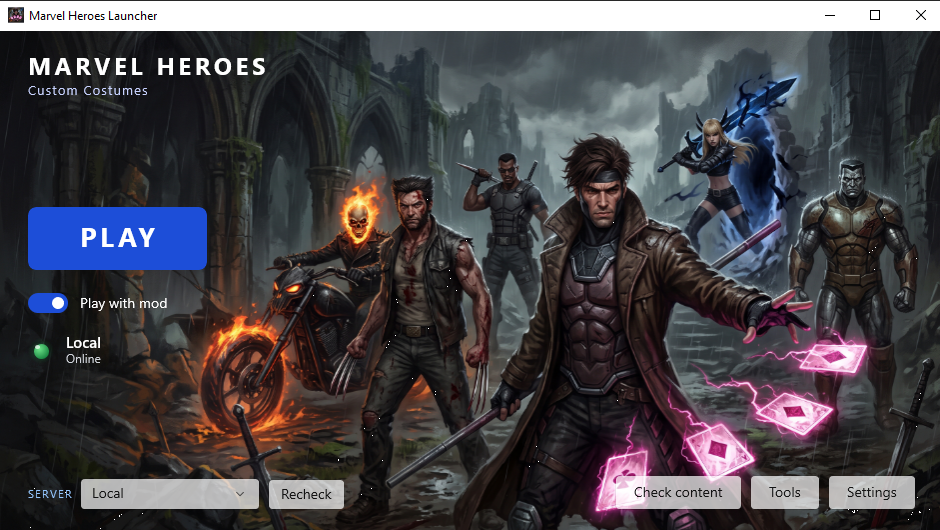

Ready to launch: the mod is enabled, the selected server is online, and **PLAY** starts the game
with the DLL injected. When something is missing the launcher says which — it does not let you
start into a broken state and find out later.

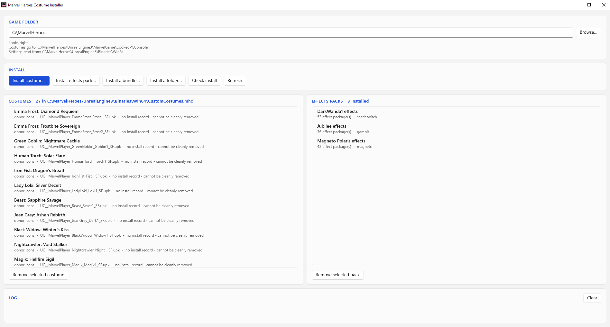

**Tools** is the installer. Costumes on the left, effect packs on the right, both read back from
what is actually on disk rather than from a list of what was meant to be there. Here: 27 custom
costumes and 3 effect packs covering Scarlet Witch, Gambit and Magneto.

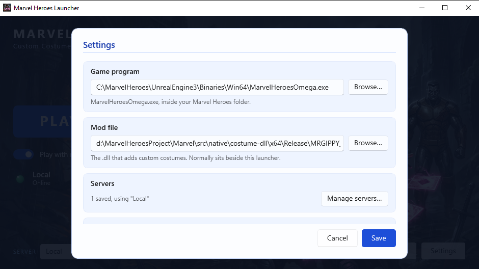
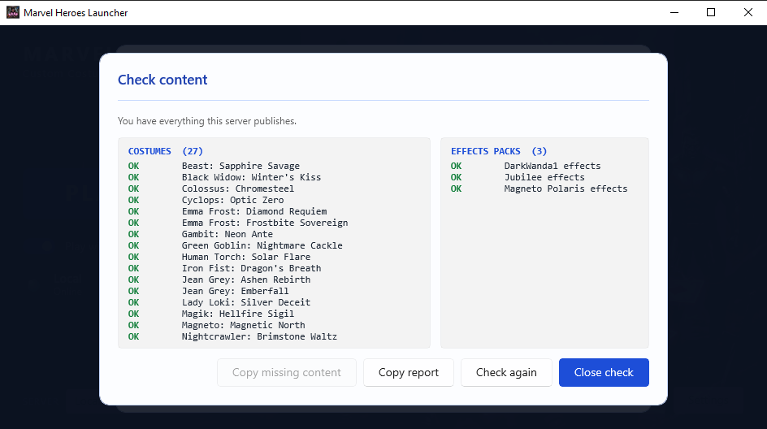

*Check content* compares the server's list against the local install, because the failure it
catches is otherwise invisible — a costume the server knows about and the client does not
renders as a different character, with no error anywhere.

---

## The Costume Manager — what the server owner runs

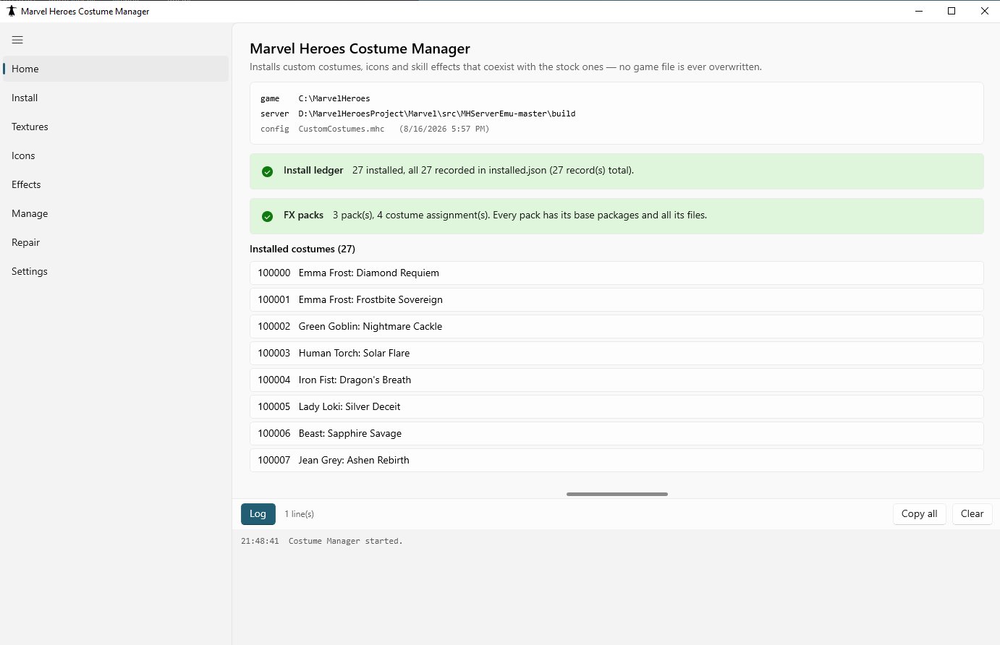

The Home page answers "is this install healthy" before anything else: which config file is
actually in use, how many costumes are installed, and whether every one of them is recorded in
the ledger. Version skew between the four programs is the most common failure on this project,
so it is the first thing shown.

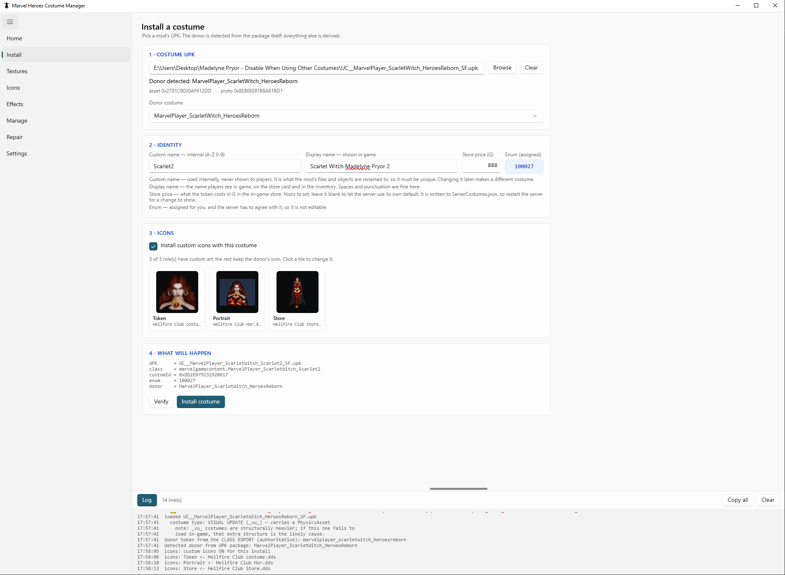

Installing a costume: pick the `.upk`, confirm the donor the Manager detected, name it, and
*Verify* before writing anything. Verify is the dry run — it reports every rename it plans,
every collision it found, and everything it refuses to touch.

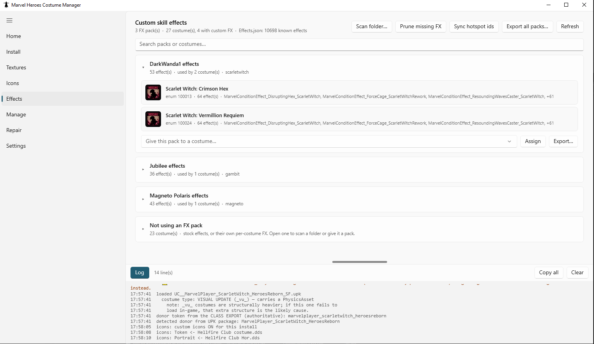

Effects, listed **pack-first** with the costumes using each one. Effect packs are shared per
hero, so two Scarlet Witch costumes cost one pack rather than two copies of 53 packages. The
last group is the costumes using no pack at all — without it, inverting the join would hide 23
of the 27.

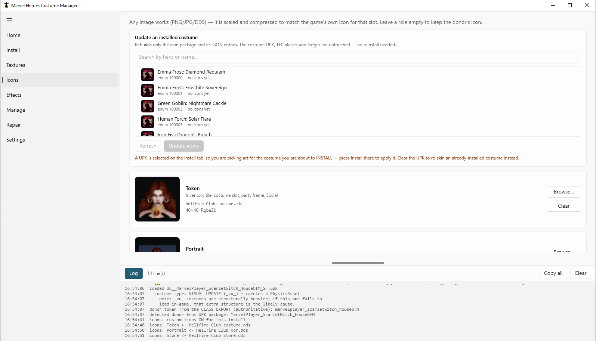
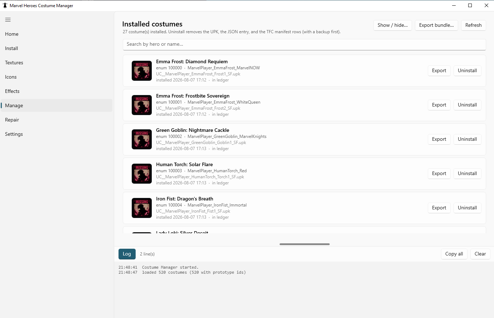

Manage handles show/hide, uninstall, and exporting `.mhcostume` / `.mhbundle` files to share.

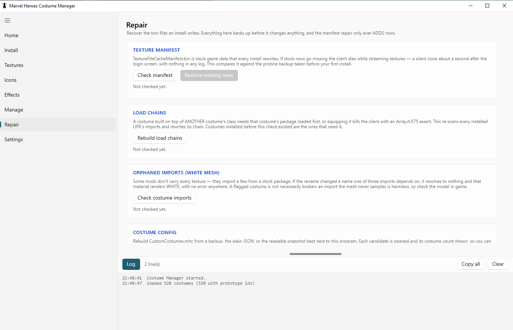

Repair exists because the problems it finds are silent. The manifest check asks both questions —
"did we lose stock rows" *and* "are the rows we added still there" — because a manifest reverted
to stock passes the first one perfectly and freezes the client on every custom costume equip.

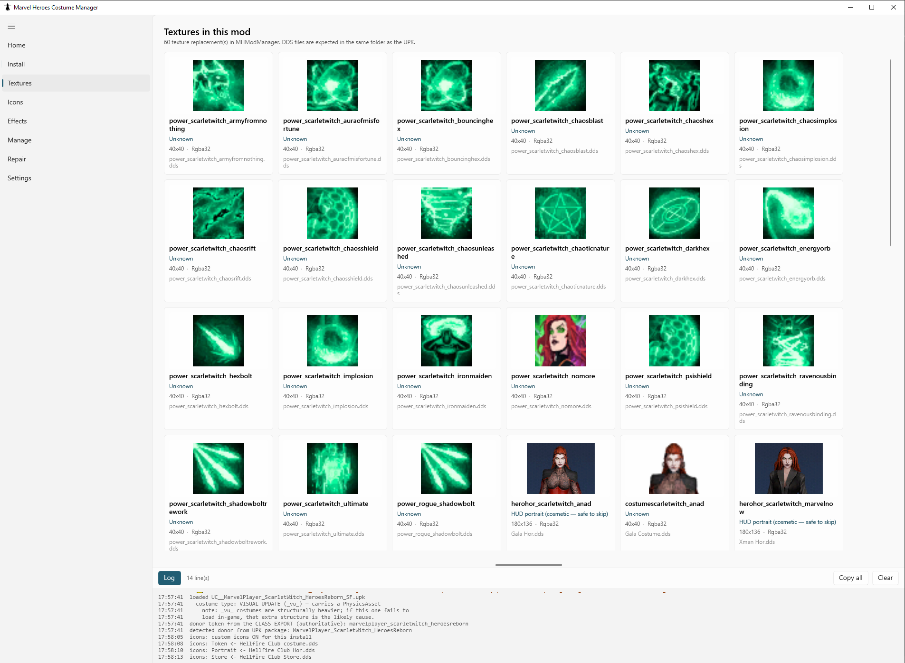
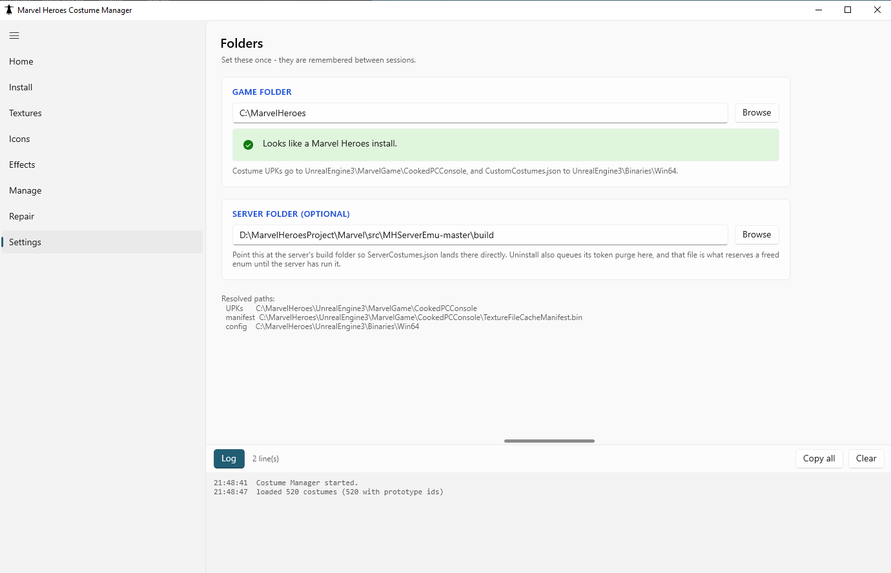

---

## Gameplay footage

Screenshots show the tools. These show the thing that actually matters: **custom and stock
content coexisting in one live game**, and each custom costume's effects belonging only to the
player wearing it.

### Two clients, Gambit — [`final_jubilee.mp4`](media/final_jubilee.mp4) · 43s

<video src="https://github.com/MrGippy626/MHCostumeMod/raw/main/docs/media/final_jubilee.mp4" controls muted playsinline width="100%">
  Your browser will not play this inline &mdash; <a href="media/final_jubilee.mp4">download final_jubilee.mp4</a>.
</video>

Two game clients side by side. Swaps to the custom costume (Jubilee), and each costume's skill 
effects change with it — the custom costume's effects render for the player wearing it and 
for nobody else.

### Two clients, Magneto / Polaris — [`final_polaris.mp4`](media/final_polaris.mp4) · 1m 17s

<video src="https://github.com/MrGippy626/MHCostumeMod/raw/main/docs/media/final_polaris.mp4" controls muted playsinline width="100%">
  Your browser will not play this inline &mdash; <a href="media/final_polaris.mp4">download final_polaris.mp4</a>.
</video>

The same demonstration on a second hero, with a longer look at the effects. Magneto MarvelNow (Donor) and
custom Magneto Polaris cast right after another and displaying the custom skill vfx.

### ⚑ Why these two are the whole proof

**A single client cannot demonstrate any of this.** Switching costumes on the only player in
the world changes "the caster's costume" and "the only custom costume in the process" at the
same instant, so a one-client clip confirms both explanations equally and settles nothing.

So what is on screen is three claims at once:

- **coexistence** — the stock costume and its custom copy exist together; nothing was overwritten
- **scoping** — a custom costume's effects apply to its wearer, not to everyone in the region
- **live swapping** — donor to custom and back, in a running session, with no restart

### Buying and wearing a costume — [`final_shop_tokens.mp4`](media/final_shop_tokens.mp4) · 1m 13s

<video src="https://github.com/MrGippy626/MHCostumeMod/raw/main/docs/media/final_shop_tokens.mp4" controls muted playsinline width="100%">
  Your browser will not play this inline &mdash; <a href="media/final_shop_tokens.mp4">download final_shop_tokens.mp4</a>.
</video>

A custom costume bought from the in-game store and equipped from the inventory. This is the
part that shows custom content is a first-class item — it has a store entry, a price, an icon
and a name, and it arrives as a token you equip like any other costume, not as a chat command.

---